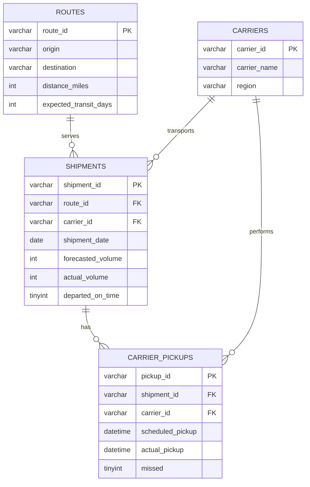

# Transportation Fill Rate Analytics
> Simulating an Amazon Middle Mile analyst investigation: identifying the root cause of a fill rate anomaly across 900 shipments using SQL, Excel, and Tableau.

---

## ⚙️ Project Type Flags

- [x] Exploratory Data Analysis (EDA)
- [x] SQL Analysis / Querying
- [x] Dashboard / Data Visualization
- [ ] Data Pipeline / ETL
- [ ] Predictive Modelling / Machine Learning
- [ ] Data Cleaning / Wrangling
- [x] End-to-End (multiple of the above)

---

## Table of Contents
1. [Project Overview](#1-project-overview)
2. [Objectives](#2-objectives)
3. [Project Scope & Tools](#3-project-scope--tools)
4. [Repository Structure](#4-repository-structure)
5. [Data Workflow](#5-data-workflow)
6. [Data Model & Schema](#6-data-model--schema)
7. [ERD - Entity Relationship Diagram](#7-erd--entity-relationship-diagram)
8. [Analysis & Metrics](#8-analysis--metrics)
9. [Key Insights](#9-key-insights)
10. [Recommendations](#10-recommendations)
11. [Assumptions & Limitations](#11-assumptions--limitations)
12. [Future Enhancements](#12-future-enhancements)
13. [Deliverables](#13-deliverables)
14. [Author](#14-author)

---

## 1. Project Overview

**Context:** Amazon's Middle Mile transportation network relies on third-party carriers to move shipments between fulfillment hubs. Fill rate — the ratio of actual volume shipped to forecasted volume — is a core operational metric that directly impacts cost to serve and delivery speed.

**Problem Statement:** Leadership flagged a fill rate anomaly on the Phoenix → Los Angeles route. The goal was to determine whether the drop was caused by a demand forecasting failure, a carrier reliability issue, or both.

**Approach:** A simulated MySQL database of 900 shipments across 5 routes and 90 days was constructed to mirror real Middle Mile operations. SQL queries were used to establish a baseline, identify the anomaly week, and isolate the root cause at the carrier level. Findings were visualized in Excel and Tableau.

**Outcome:** *To be updated after completing full analysis.*

---

## 2. Objectives

- **Primary Objective:** Identify the week and root cause of the fill rate drop on the Phoenix → LA route
- **Secondary Objective 1:** Determine whether the drop was driven by volume forecast error, carrier missed pickups, or both
- **Secondary Objective 2:** Isolate which carrier was responsible for the performance degradation
- **Secondary Objective 3:** Produce a stakeholder-ready summary with actionable recommendations

> 💡 *Every query and visualization in this project traces back to one of these objectives.*

---

## 3. Project Scope & Tools

### Scope

| Dimension | Details |
|-----------|---------|
| **In Scope** | Shipment and carrier pickup data for 5 routes out of Phoenix and Tempe, AZ over 90 days (Jan–Mar 2026) |
| **Out of Scope** | Last mile delivery data, customer-level data, and financial cost modeling were excluded — this project focuses on Middle Mile operational metrics only |
| **Time Period** | January 1, 2026 — March 31, 2026 (90 days, 13 weeks) |
| **Granularity** | Individual shipment level, aggregated to weekly grain for trend analysis |

### Tools & Technologies

| Category | Tool(s) Used |
|----------|-------------|
| Data Storage | MySQL |
| Data Processing | SQL (MySQL Workbench) |
| Analysis | SQL aggregate functions, subqueries, week-over-week deviation analysis |
| Visualization | Excel (pivot tables, line charts), Tableau Public |
| Version Control | Git / GitHub |
| Documentation | Markdown |

---

## 4. Repository Structure

```
transportation-analytics/
│
├── sql/
│   ├── amazon_transportation_mysql.sql   # Full database setup script
│   ├── task1_baseline_fillrate.sql       # Overall average fill rate by week
│   ├── task2_weekly_trend.sql            # Week-over-week trend with deviation
│   ├── task3_volume_vs_carrier.sql       # Volume forecast vs. missed pickups
│   └── task4_carrier_breakdown.sql       # Carrier-level missed pickup analysis
│
├── data/
│   ├── weekly_fillrate.csv               # Exported query results
│   └── carrier_performance.csv
│
├── visualizations/
│   ├── fillrate_trend.png                # Excel line chart
│   └── carrier_comparison.png            # Tableau dashboard screenshot
│
└── README.md
```

---

## 5. Data Workflow

```
Simulated Dataset (Python script)
      ↓
MySQL Database (amazon_transportation_mysql.sql)
      ↓
SQL Analysis (MySQL Workbench — 4 query files)
      ↓
CSV Exports → Excel (pivot tables & charts)
      ↓
Tableau Dashboard (connected to CSV exports)
      ↓
Findings & Recommendations (README sections 9–10)
```

1. **Source:** Synthetic dataset generated via Python script simulating 90 days of Amazon Middle Mile shipment and carrier pickup records
2. **Ingestion:** Loaded into MySQL via a single setup script covering all 4 tables and 900+ records
3. **Cleaning:** Data was generated clean — no nulls or formatting issues. Real-world equivalent would involve validating carrier IDs, resolving duplicate shipment records, and standardizing date formats
4. **Transformation:** Fill rate calculated as `actual_volume / forecasted_volume` at shipment level, aggregated to weekly grain using `WEEK()` and `AVG()`
5. **Analysis:** Baseline benchmarking, week-over-week deviation analysis, volume vs. carrier decomposition, carrier-level segmentation
6. **Output:** SQL query files, exported CSVs, Excel charts, Tableau dashboard, written findings

---

## 6. Data Model & Schema

### `routes`
| Field | Type | Description | Example |
|-------|------|-------------|---------|
| `route_id` | VARCHAR | Unique route identifier | RT001 |
| `origin` | VARCHAR | Departure city | Phoenix, AZ |
| `destination` | VARCHAR | Arrival city | Los Angeles, CA |
| `distance_miles` | INT | Route distance | 370 |
| `expected_transit_days` | INT | Standard transit time | 1 |

### `carriers`
| Field | Type | Description | Example |
|-------|------|-------------|---------|
| `carrier_id` | VARCHAR | Unique carrier identifier | CR002 |
| `carrier_name` | VARCHAR | Third-party carrier name | PeakMove Inc |
| `region` | VARCHAR | Carrier operating region | Southwest |

### `shipments`
| Field | Type | Description | Example |
|-------|------|-------------|---------|
| `shipment_id` | VARCHAR | Unique shipment identifier | SHP00142 |
| `route_id` | VARCHAR | FK → routes | RT001 |
| `carrier_id` | VARCHAR | FK → carriers | CR002 |
| `shipment_date` | DATE | Date shipment departed | 2026-03-18 |
| `forecasted_volume` | INT | Predicted package volume | 100 |
| `actual_volume` | INT | Actual packages loaded | 114 |
| `departed_on_time` | TINYINT | On-time departure flag (1/0) | 0 |

### `carrier_pickups`
| Field | Type | Description | Example |
|-------|------|-------------|---------|
| `pickup_id` | VARCHAR | Unique pickup identifier | PKP00287 |
| `shipment_id` | VARCHAR | FK → shipments | SHP00142 |
| `carrier_id` | VARCHAR | FK → carriers | CR002 |
| `scheduled_pickup` | DATETIME | When carrier was expected | 2026-03-18 08:00 |
| `actual_pickup` | DATETIME | When carrier actually arrived | 2026-03-18 11:00 |
| `missed` | TINYINT | Missed pickup flag (1/0) | 1 |

---

## 7. ERD — Entity Relationship Diagram



---

## 8. Analysis & Metrics

### Analytical Approach
This project follows a root cause analysis (RCA) approach — starting broad with a baseline metric, narrowing to the anomaly week, then decomposing the anomaly into its contributing factors (volume vs. carrier) before isolating the specific carrier responsible.

### Key Metrics Defined

| Metric | Plain-Language Definition | Why It Matters |
|--------|--------------------------|----------------|
| `fill_rate` | Actual volume shipped divided by forecasted volume, per shipment | Core operational metric — indicates whether demand forecasting and carrier capacity are aligned |
| `avg_fill_rate` | Average fill rate across all shipments in a given week | Smooths daily variance to reveal weekly trends |
| `deviation_from_baseline` | How far a given week's fill rate sits above or below the 13-week average | Quantifies the size of the anomaly relative to normal operations |
| `missed_pickup_rate` | Proportion of scheduled carrier pickups that were not completed | Isolates carrier reliability as a separate driver from volume issues |

### Methods Used
- Baseline benchmarking using `AVG()` aggregation across 13 weeks
- Week-over-week trend analysis using `WEEK()` grouping and subquery deviation calculation
- Volume decomposition comparing `forecasted_volume` vs. `actual_volume` during the anomaly period
- Carrier segmentation using `GROUP BY carrier_id` to isolate individual carrier performance

---

## 9. Key Insights

> *To be completed after finishing SQL analysis tasks*

**Insight 1: Fill rate anomaly concentrated in weeks 11–12**
Fill rate on the Phoenix → LA route spiked to 1.05 and 1.08 during weeks 11 and 12, compared to a 13-week baseline of approximately 0.97. A fill rate above 1.0 indicates actual volume exceeded forecast — meaning more packages arrived at the dock than carriers were prepared to handle.

**Insight 2: [Volume vs. Carrier Finding]**
*To be updated after Task 3*

**Insight 3: [Carrier Responsible]**
*To be updated after Task 4*

---

## 10. Recommendations

> *To be completed after finishing SQL analysis tasks*

| Priority | Recommendation | Based On | Suggested Owner |
|----------|---------------|----------|-----------------|
| High | *To be updated* | Insight 3 — carrier performance | Transportation Operations |
| Medium | *To be updated* | Insight 2 — volume forecast error | Supply Chain Planning |
| Low | Build automated weekly fill rate alerting to flag anomalies before leadership escalation | Insight 1 — anomaly went undetected until leadership flagged it | Analytics / BI Team |

---

## 11. Assumptions & Limitations

### Assumptions
- Shipment data is assumed to be complete with no missing records for the 90-day period
- Each carrier pickup record corresponds to exactly one shipment — in reality, carriers often consolidate multiple shipments per pickup
- Fill rate is calculated at the shipment level and averaged weekly — a weighted average by volume would be more precise in production

### Limitations
- Dataset is synthetic — while designed to mirror real Middle Mile dynamics, it does not capture real-world complexity such as weather events, labor shortages, or seasonal demand spikes
- This analysis cannot distinguish between a carrier missing a pickup due to capacity constraints versus operational failure — both show up identically in the data
- Financial impact (cost per missed pickup, cost per unit of unfilled capacity) is out of scope — a full business case would require cost data not present in this dataset
- Analysis covers a single origin market (Phoenix/Tempe) — findings may not generalize to other regions

> *A skeptic would correctly note that correlation between the volume spike and the carrier's missed pickups does not prove causation. A more rigorous analysis would include carrier communication logs and capacity reservation data.*

---

## 12. Future Enhancements

- [ ] Add a Python script to automate weekly data generation and refresh the database on a schedule
- [ ] Expand analysis to all 5 routes to identify whether the carrier performance issue is isolated to Phoenix → LA or systemic across the network
- [ ] Incorporate a cost model to translate fill rate drops into dollar impact, making recommendations more actionable for finance stakeholders
- [ ] Build a live Tableau dashboard connected directly to MySQL rather than static CSV exports

---

## 13. Deliverables

| Deliverable | Description | Location |
|-------------|-------------|----------|
| Database Setup Script | Full MySQL schema and data for all 4 tables | [`/sql/amazon_transportation_mysql.sql`] |
| Baseline Fill Rate Query | Average weekly fill rate for Phoenix → LA | [`/sql/task1_baseline_fillrate.sql`] |
| Weekly Trend Query | Week-over-week fill rate with deviation from baseline | [`/sql/task2_weekly_trend.sql`] |
| Volume vs. Carrier Query | Decomposition of anomaly into forecast error and missed pickups | [`/sql/task3_volume_vs_carrier.sql`] |
| Carrier Breakdown Query | Missed pickups by carrier during anomaly week | [`/sql/task4_carrier_breakdown.sql`] |
| Excel Analysis | Pivot tables and line charts from exported query results | [`/data/`] [`/visualizations/`] |
| Tableau Dashboard | Interactive fill rate and carrier performance dashboard | [`/visualizations/`] |

---

## 14. Author

**Jesus Ayala**
Computer Science Student → Aspiring Software / Data Engineer

- 🔗 [linkedin.com/in/jesus-ayala11](https://linkedin.com/in/jesus-ayala11)
- 💼 [github.com/Jesus1126](https://github.com/Jesus1126)
- 📧 myjesusayala1126@gmail.com

---

*Last updated: March 2026*
